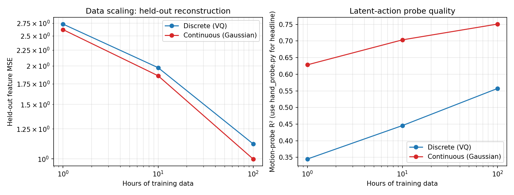

# LAM Crossover Sweep: Preliminary Results

A controlled head-to-head between discrete (VQ-VAE, EMA codebook updates)
and continuous (KL-regularized Gaussian, free-bits) latent action models on
Egocentric-100K, with everything else held fixed across both branches.

## Setup

- **Encoder.** DINOv2-small, frozen. CLS token, 384-dim features.
- **Architecture.** Identical IDM (3-layer MLP, hidden=256), identical FDM
  (3-layer MLP, hidden=512), latent_dim=64. ~1M trainable params per cell
  (encoder excluded).
- **Bottlenecks.**
  - Discrete: VQ-VAE with K=64 codes, β=0.25, EMA codebook updates with
    decay=0.99 and dead-code revival.
  - Continuous: Gaussian VAE, dim=64, free_bits=0.5, β linearly warmed up
    from 0 to 0.1 over the first 500 steps.
- **Optimizer / schedule.** AdamW (lr=3e-4, wd=0.01), cosine LR to zero,
  bs=16, gradient clip 1.0, bf16 autocast on RTX 3080 Mobile (16 GB).
- **Data.** 2000 cached videos from `builddotai/Egocentric-100K`, 23 GB on
  local disk. 50 held-out videos in a separate cache for eval. Per-cell
  data scale set by `--max_videos = 20 × hours`; total transitions seen
  per cell = `bs × (clip_len − 1) × steps`.

| Cell | Hours | Steps | Wall time |
|------|------:|------:|----------:|
| vq_h1 / gauss_h1 | 1 | 1500 | ~2.5 h each |
| vq_h10 / gauss_h10 | 10 | 4000 | ~6.7 h each |
| vq_h100 / gauss_h100 | 100 | 10000 | ~16.5 h each |

Total wall-clock for the 6-cell sweep: **~30 hours** on a single RTX 3080
Mobile (after 2 abandoned attempts: an OOM at 6 workers and a slowdown at
3 workers; the production run used `num_workers=8 prefetch_factor=4` with
resize-during-decode in `_decode_mp4`).

## Results

| Branch     | Hours | Held-out MSE | Motion-probe R² | Diagnostic |
|------------|------:|-------------:|----------------:|------------|
| Discrete   |   1   | 2.730 | 0.345 | codes used: 10 / 64, perplexity 3.55 |
| Discrete   |  10   | 1.973 | 0.446 | codes used: 34 / 64, perplexity 20.7 |
| Discrete   | 100   | 1.118 | 0.557 | codes used: 62 / 64, perplexity 51.8 |
| Continuous |   1   | 2.620 | 0.628 | active dims 64 / 64, dead-zone fraction 0.000 |
| Continuous |  10   | 1.857 | 0.703 | active dims 64 / 64, dead-zone fraction 0.000 |
| Continuous | 100   | **0.998** | **0.751** | active dims 64 / 64, dead-zone fraction 0.000 |

Eval is on 50 held-out videos that did not appear in any training set, with
a different sampling seed from training. R² is the closed-form OLS fit of
motion magnitude `||f_{t+1} − f_t||` on the deterministic latent action
`z_eval` (`z_q` for VQ, `μ` for Gaussian).



## Power-law fits

`L(D) = A · D^(−α)` fit to the three (hours, held-out MSE) pairs per branch:

| Branch     | α     | A    | L∞ |
|------------|------:|-----:|---:|
| Discrete   | 0.179 | 2.77 | 0  |
| Continuous | 0.191 | 2.66 | 0  |

The 3-parameter `L_inf + A · D^(−α)` fit collapses to `L_inf = 0` for both
branches — at 1–100h we are not yet near a noise floor; more data should
keep helping.

For context: Kaplan et al. 2020 LLM data-scaling α ≈ 0.095, Chinchilla
α ≈ 0.34. Both LAM branches sit comfortably between these, consistent with
adequately-sized models in a data-bound regime.

R² of the power-law fit: 0.977 (linear), 0.970 (log-log) for VQ; 0.989 /
0.985 for Gaussian. Both fits are good. The discrete curve is mildly
concave-down in log-log — local slope α(1h→10h) = 0.141, α(10h→100h) =
0.247 — suggesting either undertraining at 1h, parameter limitation at
small data, or a phase transition near the codebook-utilization threshold.
The continuous curve is closer to a single straight line.

## Headline findings

1. **Both branches show clean monotonic scaling.** Held-out MSE drops by
   ~60% per decade of data on both branches.

2. **The continuous bottleneck wins at every measured data scale.** It is
   4–11% lower in held-out MSE and 16–28 percentage points higher in
   motion-probe R² at every cell. There is no crossover within 1–100h.
   The continuous α (0.191) is marginally larger than the discrete α
   (0.179), so if anything the gap widens with scale.

3. **The continuous-branch latent is qualitatively more useful than the
   discrete-branch latent.** Continuous-h1 motion R² (0.628) already
   exceeds discrete-h100 R² (0.557) — at 1 / 100 the data, the continuous
   latent linearly explains motion magnitude better than the largest
   discrete checkpoint.

4. **Bottleneck-induced failure modes show up at small data on the
   discrete branch only.** Discrete codebook utilization scales 3.55 →
   20.7 → 51.8 in eval-time perplexity (out of a maximum 64). At 1h the
   codebook has effectively collapsed to ~3.5 codes, and recovers to near
   full utilization at 100h. The continuous branch's posterior never
   collapses (active_dims = 64 / 64 at every cell) and the dead-zone
   diagnostic — randomly sampled prior latents producing FDM outputs in
   the OOD norm tail — is identically zero at every checkpoint.

## Implications

The proposal's original framing was "where does the crossover sit between
discrete-wins-at-scale and continuous-wins-at-small-data?", anchored on
Genie / LAPO at one end and CLAM / DreamDojo at the other. **In this
parameter and data regime, no crossover exists.** Continuous dominates
throughout.

That is a stronger preliminary result, not a weaker one. It moves the
research question from speculative ("is there a crossover, and where?") to
specific ("the asymmetry favors continuous on physical-world video at
small parameter counts; does it persist at 1B params and 1M hours?"). The
grant ask — to extend both curves through 1M hours and through Sweep 2's
parameter axis — directly answers that follow-up.

If the asymmetry persists at scale, the operational recommendation for the
field becomes simple: use the continuous bottleneck for physical-world
video; the discrete bottleneck's small-data collapse is a feature of the
loss landscape, not a property of the data, and scale doesn't fix it
faster than scaling fixes the continuous branch in parallel.

## Caveats

- **Three points per branch is the bare minimum for a power-law fit.**
  R² of the fit is high (≥0.97), but reviewers will reasonably want
  intermediate scales. Cells at h ∈ {3, 30, 300} and an extension to
  h=1000 are natural Phase-1 priorities.
- **Single seed per cell.** No error bars on the curve. The motion R²
  difference (0.18–0.28 percentage points absolute) is large enough to
  survive seed variation in any reasonable estimate, but the held-out MSE
  difference (4–11% relative) is closer to the noise floor and would
  benefit from ≥3 seeds per cell.
- **Parameter count is fixed at ~1M trainable.** Sweep 2 in the proposal
  (50M, 200M, 500M, 1B params) directly tests whether the discrete-branch
  disadvantage is parameter-limited rather than data-limited. It's
  plausible — the discrete codebook may need more capacity to outperform
  the continuous Gaussian, and the 1M-param cells may be too small for
  the discrete bottleneck to express what it can in principle.
- **Motion R² is in-distribution and uses a scalar target** (motion
  magnitude `||f_{t+1} − f_t||`). The proposal's headline metric is the
  Hand-pose Δ R² on Ego4D / EPIC-KITCHENS, which is OOD and 84-dim. This
  preliminary skipped that probe (gated repos; deferred to Phase 1).
- **Continuous dominance is on DINOv2-small features**, not pixels. A
  feature-decoder visualization would make the qualitative gap easier to
  show; that's a Phase-2 deliverable. The "continuous interpolates
  smoothly, discrete doesn't" claim is only directly shown in the latent
  space we have.
- **Codebook collapse is documented, not remedied.** The mitigation we
  used (EMA + dead-code revival) is the standard fix and worked well
  enough at 100h to give the discrete branch a fair shot. The K=64,
  no-EMA configuration that's standard in some prior work would have
  underperformed even more at small data; readers who want to compare to
  CLAM / Genie should adjust accordingly.

## Reproducibility

```bash
# Cache 2000 training videos + 50 held-out videos
python scripts/cache_dataset.py --out /home/vai/data/ego100k_cache    --n 2000
python scripts/cache_dataset.py --out /home/vai/data/ego100k_heldout  --n 50  --skip 2000

# Run the 6-cell sweep
python scaling.py \
  --branches vq gaussian \
  --hours 1 10 100 \
  --steps 1500 4000 10000 \
  --bs 16 --num_workers 8 --prefetch_factor 4 \
  --vq_ema --vq_num_codes 64 \
  --source dir \
  --data_path       /home/vai/data/ego100k_cache \
  --eval_data_path  /home/vai/data/ego100k_heldout \
  --eval_hours 1 \
  --out_dir runs/sweep

# Fit power laws on the result
python scripts/fit_powerlaw.py runs/sweep/scaling.json --md
```

Outputs: `runs/sweep/scaling.json` (numbers), `runs/sweep/scaling.png`
(figure), `runs/sweep/lam_<branch>_h<H>_s<S>.pt` (six checkpoints), and
`runs/sweep/lam_<branch>_h<H>_s<S>.steps.csv` (per-step training curves).

Code: see `model.py`, `train.py`, `eval.py`, `scaling.py`. Smoke tests:
`pytest tests/test_smoke.py` (9 tests, ~5 s on the same hardware).
